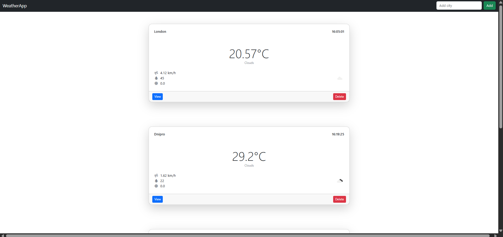
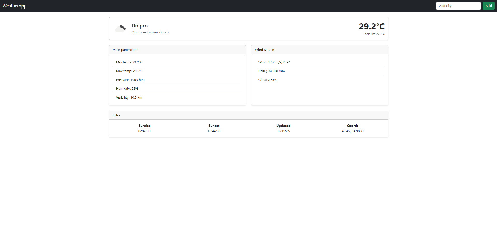

<h1>Weather FastAPI Application</h1>

<h2>About Weather App</h2>

<strong>Weather App</strong> is a web application for <strong>fetching, storing, and displaying weather data</strong>. 
It uses FastAPI, SQLite, and Docker to provide both a web interface and REST API for accessing weather information.

 

The application is built <strong>asynchronously</strong>.

<h2>Technologies:</h2>
<ul>
  <li>Python</li>
  <li>FastAPI</li>
  <li>SQLite</li>
  <li>SQLAlchemy (async support)</li>
  <li>Jinja2 templates for HTML rendering</li>
  <li>Docker & Docker Compose</li>
  <li>HTML + CSS</li>
  <li>Pytest</li>
</ul>

<h2>Project Structure:</h2>
<ul>
  <li><code>app/</code> — FastAPI application</li>
  <li><code>img/</code> — static images (if used)</li>
  <li><code>tests/</code> — Pytest tests</li>
  <li><code>Dockerfile</code> — Docker image configuration</li>
  <li><code>docker-compose.yml</code> — Docker Compose config</li>
  <li><code>requirements.txt</code> — Python dependencies</li>
  <li><code>.env</code> — Environment variables</li>
  <li><code>data.db</code> — SQLite database</li>
  <li><code>README.md</code> — This file</li>
</ul>

<h2>Setup & Installation</h2>
<h3>Using Docker Compose:</h3>
<ol>
  <li>Build and start the application:
    <pre><code>docker-compose up --build</code></pre>
  </li>
  <li>Open in browser: <a href="http://localhost:8000">http://localhost:8000</a></li>
</ol>

<h3>Using Docker</h3>
<ol>
  <li>Build and start the application:
    <pre><code>docker build -t weather-app .</code></pre>
  </li>
  <li>Open in browser: <a href="http://localhost:8000">http://localhost:8000</a></li>
</ol>

<h3>Local Python setup (if not using Docker):</h3>
<ol>
  <li>Run the development server:
    <pre><code>uvicorn app.main:app --reload</code></pre>
  </li>
  <li>Open browser: <a href="http://localhost:8000">http://localhost:8000</a></li>
</ol>

<h2>Routes Overview</h2>
<table border="1" cellpadding="5" cellspacing="0">
  <tr>
    <th>Route</th>
    <th>Method(s)</th>
    <th>Description</th>
  </tr>

  <tr>
    <td><code>/weather/</code></td>
    <td>GET</td>
    <td>List all weather records</td>
  </tr>
  <tr>
    <td><code>/weather/add</code></td>
    <td>POST</td>
    <td>Fetch weather from external API and add to database</td>
  </tr>
  <tr>
    <td><code>/weather/{city}</code></td>
    <td>GET</td>
    <td>Get weather for a specific city</td>
  </tr>
  <tr>
    <td><code>/weather/delete/{city}</code></td>
    <td>POST</td>
    <td>Delete a weather record via HTML form</td>
  </tr>

  <tr>
    <td><code>/weather_docs/</code></td>
    <td>GET</td>
    <td>List all weather records via API</td>
  </tr>
  <tr>
    <td><code>/weather_docs/{city}</code></td>
    <td>GET</td>
    <td>Get weather info for a specific city via API</td>
  </tr>
  <tr>
    <td><code>/weather_docs/api/{city}</code></td>
    <td>POST</td>
    <td>Fetch weather from external API and add to database</td>
  </tr>
  <tr>
    <td><code>/weather_docs/{city}</code></td>
    <td>DELETE</td>
    <td>Delete a weather record for a specific city via API</td>
  </tr>
</table>

<h2>Running Tests</h2>

Tests are written using <strong>pytest</strong>. Run them directly:

<h3>Locally:</h3>
<pre><code>pytest -s -v
</code></pre>

<h3>Using Docker Compose:</h3>
<pre><code>docker-compose run --rm tests pytest tests/test_weather.py
</code></pre>

<h3>Using Docker Image:</h3>
<pre><code>docker run --rm -v %cd%:/app -w /app weather-app pytest
</code></pre>

<em>Note:</em> On Linux/macOS, replace <code>%cd%</code> with <code>$PWD</code>.

<h2>Notes</h2>
<ul>
  <li>HTML forms use POST for creating/deleting records.</li>
  <li>API uses DELETE method for removing records.</li>
  <li>Database file: <code>data.db</code></li>
  <li>View logs: <code>docker logs -f &lt;container_name&gt;</code></li>
</ul>

 

    

<em>Figure: Home page</em>

 

    

<em>Figure: Weather detail page</em>

